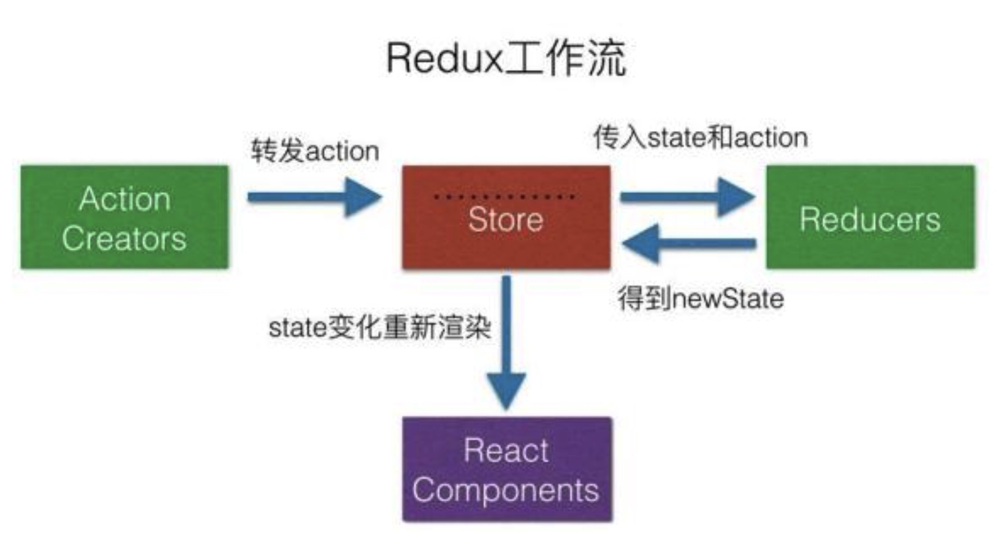

### Redux
yarn add create-react-app
yarn add redux
yarn add antd 
install create-react-app demo01
### Chrome
marketing search "redux dev"
store->index.js add：
```
const store = createStore(
    reducer,
    // add
    window.__REDUX_DEVTOOLS_EXTENSION__ && window.__REDUX_DEVTOOLS_EXTENSION__()
)

```

### Redux Flow


### Study
01 初始化以及读取store中的数据

02 更新store中的数据 state数据从redux获取新的数据并展示

03 点击功能 input中的数据放到store中的list里面，再将store中更新后的list数据返还给state（setState渲染页面）

04 list中点击删除项目事件

05 优化1：将请求的类型变量常量话，这样当常量写错时会报错，而变量不会报错，可以快速定位到错误的地方
05 优化2：将调用方法统一写到一个文件actionCreators.js中，方便管理和调用
05 三个坑:
1. store必须是唯一的，只有一个store空间
2. 只有store能改变自己的内容，Reducer不能改变 （Reducer里面只能接受state,不能改变state）
3. Reducer中 必须是纯函数，不能直接给数字或者new之类可变内容，只能 变量赋值给变量 a=b
